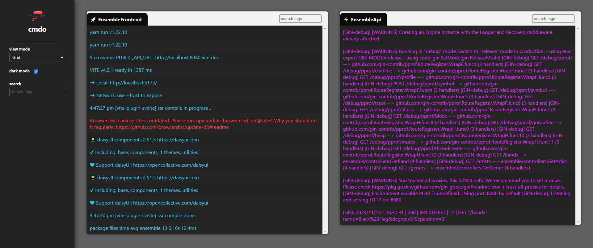

# cmdo

`cmdo` ("commando") - run multiple commands in parallel



## Usage

Supply a configuration file containing different commands you want to execute in parallel

### Installation

#### Via Go (recommended)

```bash
go install github.com/ryanachten/cmdo@main # install latest from main branch
cmdo --config .\example-config.json # use cmdo!
```

### Arguments

```bash
cmdo --config .\example-config.json --tags backend --exclusions EnsembleApi --web=false
```

| command        | required | type     | default | description                                                                     |
| -------------- | -------- | -------- | ------- | ------------------------------------------------------------------------------- |
| `--config`     | true     | string   |         | points to a configuration file using the schema below                           |
| `--tags`       | false    | string[] | []      | when defined, only commands _with_ supplied `tags` in configuration will be run |
| `--exclusions` | false    | string[] | []      | when defined, only commands _without_ supplied `name` will be run               |
| `--web`        | false    | bool     | true    | opts out of web view and only outputs using stdout and stderror                 |

### Configuration

The configuration file must conform to the following API:

```typescript
  commands: {
    name: string, // label to be presented in the UI
    executable: string, // command to to be executed
    arguments: string[], // arguments to be passed to the command
    workingDirectory: string, // working directory where the command should be executed
    tags?: string[] // (optional) tags used to include exclude commands
  }[],
```

#### Examples

Examples of different configuration can be found in the [examples](./examples/) directory.

One example using the [ensemble](https://github.com/ryanachten/ensemble) project is as follows:

```json
{
  "commands": [
    {
      "name": "EnsembleFrontend",
      "executable": "yarn",
      "arguments": ["run", "dev"],
      "workingDirectory": "C:\\dev\\ensemble\\client",
      "tags": ["frontend"]
    },
    {
      "name": "EnsembleApi",
      "executable": "go",
      "arguments": ["run", "."],
      "workingDirectory": "C:\\dev\\ensemble\\api",
      "tags": ["backend"]
    }
  ]
}
```

## Development

### Prerequisites

- Go installed locally (>v1.21)

### Running locally

```bash
# from project root directory
go run . --config .\examples\ensemble.cmdo.json
```
